# Apollo3-Patient Isolation Hood

## General Information

**Category** : Labware + Devices

**Keywords** :Patient Isolation Hood, PIH, PPE

**Content of Package** :
- Apollo ReadMe (This) [**Print Ready**](README.pdf)
- Apollo3 Vector Cut File (.dxf) - [**Download HERE**](Dxf_cut_files/2020_05_05%20Apollo3_Cut%20File.dxf)
- Apollo Video:  [**Vimeo Link**](https://vimeo.com/415250896)

---
>**For questions, comments, issues and feedback email : [MaP+S Group](mailto:mapsgroup@gsd.harvard.edu?subject=[Apollo3-PIH])**
---

### Disclaimer
Please note: On Friday, May 1 the FDA issued an Emergency Use Authorization for Protective Barrier Enclosures.  The authorization provides specific guidance for manufacturing.  The Apollo PIH has not yet been evaluated with respect to these guidelines.  The letter and two associated fact sheets are available at [https://www.fda.gov/medical-devices/emergency-situations-medical-devices/emergency-use-authorizations#covid19ppe](https://www.fda.gov/medical-devices/emergency-situations-medical-devices/emergency-use-authorizations#covid19ppe).  

The product as a protective barrier enclosure, provides an extra layer of barrier protection in addition to PPE and is not meant to replace PPE.

Please also note: The Apollo PIH is under active development and refinement.  Please check this repository often for design modifications and additional information. 

The Apollo PIH has been tested by clinicians at Massachusetts General Hospital and Boston Children's Hospital, but there are many different regulations regarding medical devices so please follow local guidelines that apply to your region. Please note that safety is the primary objective. Medical equipment must be approved before it is distributed. This is possibly a matter of life or death. 

This work may be reproduced, modified, distributed, performed, and displayed for any purpose, but must acknowledge the Apollo PIH project. Copyright is retained and must be preserved. The work is provided as is; no warranty is provided, and users accept all liability.

### License
Except where otherwise noted, content on this project is licensed under a [Creative Commons Attribution-ShareAlike 4.0 International license](https://creativecommons.org/licenses/by-sa/4.0/). See [License](LICENSE.md).
***
## Project Overview

> 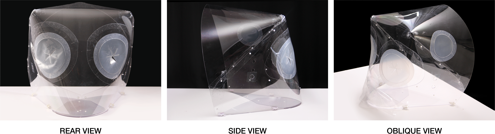

### Description
The Apollo Patient Isolation Hood (PIH) is a localized negative-pressure ventilation system for hospital beds to help contain the droplet spread of COVID-19, including during aerosol-generating medical procedures such as intubation and extubation. The PIH encloses a patient’s upper torso and head in a negative-pressure environment. It provides barrier protection between healthcare provider (HCP) and patient, and aerosol control via the negative pressure environment. The hood may also contain the spread of the virus from less critically-ill patients, reducing the need for invasive procedures.

The versatility of the Apollo PIH means that it can be used in any care setting (OR, PACU, ICU, ED, EMS) and can be rapidly secured to a variety of beds.  The lightweight (<5 lbs) design allows for ease of assembly, use, and disposal. The primary structure is composed of a single flat sheet of PETG plastic that is assembled into a 3-dimensional form, minimizing the number of seams for optimal viewing clarity.  Flexible sealed armports provide HCP access to patients.  A minimal amount of folds and seams in the primary enclosure provide optimal viewing clarity.  

### Design Concept
The primary design goal of the hood was to enclose the patient’s torso and head without restricting HCP ability to provide care or inducing claustrophobia in patients. The enclosure of the Apollo PIH derives its form and rigidity through the principle of active bending, a structural behavior achieved by the elastic deformation of initially flat elements. The main intention was to leverage this structural principle to create a stable, rapidly deployable 3D form that can be fabricated from readily available sheet materials using minimal joinery.

### Key Features
The primary design element of the Apollo PIH is the enclosure - a thin sheet of clear PET-G plastic in 60mil (approximately 1/16”) thickness.  The enclosure can be CNC cut from a flat sheet of PET-G  measuring a minimum of 48” x 72”.  The Apollo PIH enclosure measures approximately 22” in width, 23” in height and 22” in depth and is approximately 0.15 m3 in volume.

> 

Several key features of the prototype are outlined below:
- (2) arm ports at the rear of the PIH provide healthcare provider (HCP) access to the patient. - An additional auxiliary port on one side of the PIH allows for additional patient access as needed.
- Minimal surface seams allow for an unobstructed view of patient.
- Adaptable attachment mechanism allows for use on a variety of bed types (OR, ICU, etc.)
- Side arms provide a double thickness at the base of the PIH for stability and structure
- Various suction ports accept common negative pressure hoses, including a ⅞” diameter (common in OR) as well as smaller 3/16” ID tubing (common in the ICU).  
***
 ### Flow and Pressure Testing - 👨‍⚕MGB
  Work in Progress
  Negative Pressure Hood Working:-  [YouTube Link](https://youtu.be/yTqlieDpH2M)
  ***

## Production Details

### Bill of Materials

Item Description  | Dimensions( in or sqrIn) | Quantity | Link | Notes
|------------- | ------ | -------------| -------------| -------------|
 3/16" bungee cord | 12" | 2 |[Amazon](https://www.amazon.com/T-W-Evans-Cordage-SC-316-100-100-Feet/dp/B00DKA4VQG/ref=sr_1_3?dchild=1&keywords=white+bungee+cord+3%2F16%22&qid=1587383739&s=sporting-goods&sr=1-3-catcorr)
 Velcro cord management strap  | n/a | 2 | [Amazon](https://www.amazon.com/Pasow-Reusable-Fastening-Adjustable-Management/dp/B01CFKQYAW/ref=sr_1_4?dchild=1&keywords=cord+management+velcro+white&qid=1587394037&sr=8-4)
 Adjustment Hook  | n/a | 2 | [Amazon](https://www.homedepot.com/p/ProGrip-Better-Than-Bungee-6-ft-100-lbs-Break-Strength-Particle-Rope-Lock-Paracord-055160/206957471?modalType=drawer)
 Push-In Rivet  | n/a | 17 | [McMaster-Carr](https://www.mcmaster.com/90136a574)
 Button Snaps  | n/a | 1 |  [McMaster-Carr](https://www.mcmaster.com/95691a660) | *1*
 Drape tape / seam tape (must be low surface energy tape)  | 61" | 1 | [HomeDepot](https://www.homedepot.com/p/Gorilla-1-5-in-x-5-yds-Crystal-Clear-Tape-5-Pack-6015002/205493971?mtc=Shopping-B-F_D24-G-D24-Multi-Multi-NA-Feed-PLA-NA-NA-All_Paint&cm_mmc=Shopping-B-F_D24-G-D24-Multi-Multi-NA-Feed-PLA-NA-NA-All_Paint-71700000032325895-58700003835893718-92700030694006321&gclid=CjwKCAjwkPX0BRBKEiwA7THxiJXWI0-JAcbqYryMsjvaev1nBxPw_FWMW1czSJxp9qHvZyLyDKl_yhoCxfgQAvD_BwE&gclsrc=aw.ds) | *2*
 LDPE film (2mil)  | 40" | 1 | [Uline](https://www.uline.com/Product/Detail/S-5445/Plastic-Sheeting/Clear-Poly-Sheeting-2-Mil-8-x-200) 
 1/16" PET-G sheet | 72x48" | 1 | n/a
 Tpu film for port holes (2-5mil)  | 13" X 13"| 2 | n/a
 Tpu film for port hole flaps (2-5mil) | 13" x 13" | 2 | n/a
 Adhesive sheet for attaching handports | 13" x 13" | 4 | [Laminator.com](https://www.laminator.com/51-x-150ft-optically-clear-double-sided-mounting-adhesive-permanent-permanent.html)
 Colored vinyl stickers for intuitive assembly and risk warning | n/a | 4 | [Overnightprints.com](https://www.overnightprints.com/stickers)
 95 gallon clear trash bag for disposal | n/a | 1 | [Uline](https://www.uline.com/Product/Detail/S-15540/Trash-Liners-Bags/Uline-Trash-Liners-95-Gallon-25-Mil-Clear?pricode=WB0503&gadtype=pla&id=S-15540&gclid=Cj0KCQjwhZr1BRCLARIsALjRVQOMShqprypOodH6yqqy-GNPSxb2Hep2NU1SgADXMQsUt7F44VXUqlQaAiDwEALw_wcB&gclsrc=aw.ds)
 Instruction Sheet | n/a | 1 
 1 gallon ziploc to hold instructions and cords | n/a 
---
*1. The button snap used for locking the fixing the position of the baseplate can be replaced by a push-in rivet if needed.*

*2. Must be low-surface-energy tape.*

---
### Recommended Production Guidelines

#### A) Enclosure
#### 1. Cutting
The Apollo PIH requires a minimum stock size of 72” x 48”. The stock can be cut using a number of CNC processes including a knife cutter, laser cutter, or router.  In the case of a CNC router, a ⅛” diameter endmill is required to successfully cut small interior features.  A list of suggested cut settings are provided below.  Please keep in mind that these settings are specific to the machines listed and will likely need to be modified for other scenarios. 
- Knife Cutter ([Zund G3M2500](https://www.zund.com/en/cutting-systems/digital-cutting-systems/g3-cutter))
  - Bed Size: 98” x 52”
  - Tool: Universal Cutting Tool (UCT) with [glide shoe](https://shop.zund.us/en-us/products/alle-produkte/cutting-accessories/gliding-shoe))
  - Blade: Type6 blade
  - Depth: 0.02” per pass
  - Speed : 6” per second 
  - Total Time : ~ 18 minutes.
- Laser Cutter (*450 Watt Multicam Magnus 48x96 CNC Laser, 4” Focal Lens*)
  - Speed: 480 IPM
  - Power 60%
  - Frequency: 10,000 PPI

#### 2. Base-Plate Braking/Bending
 

*Caution : Do not score the material before bending/braking* 

The baseplate portion of the Apollo PIH enclosure must be cold-formed to a 90 degree angle relative to the rest of the enclosure prior to assembly.  To date, this has been successfully accomplished on a sheet metal finger brake such as the Baileigh SBR-4020 shear brake roll ([Link](https://www.baileigh.com/shear-brake-roll-sbr-4020)).
Additional forming processes such as the use of a line brake or heat gun, or design modifications to the enclosure such as eliminating the base plate or incorporating a secondary hinge mechanism, exist as potential alternatives though they have not been tested by the design team. 

#### 3. Push-in Rivets

Push-in plastic rivets were selected as the preferred fastener, as they were simple to use and had no sharp edges that could catch on to clothing, medical instruments etc. 3/16” holes in the main enclosure facilitate the riveting and was done by hand. 16 rivets are needed (8 per side of symmetry) for maintaining the shape of the Apollo while 2 rivets (or 1 rivet & a button snap)are needed for the baseplate ( 1 to pivot (*red*) and 1 to lock (*blue*)).

  

*The width of the Apollo can be adjusted by adjusting the location of the pivot and the lock.Multiple perforations can be added to have it adapt to a range of widths.*

#### B) ArmPorts + Auxiliary Ports

 

  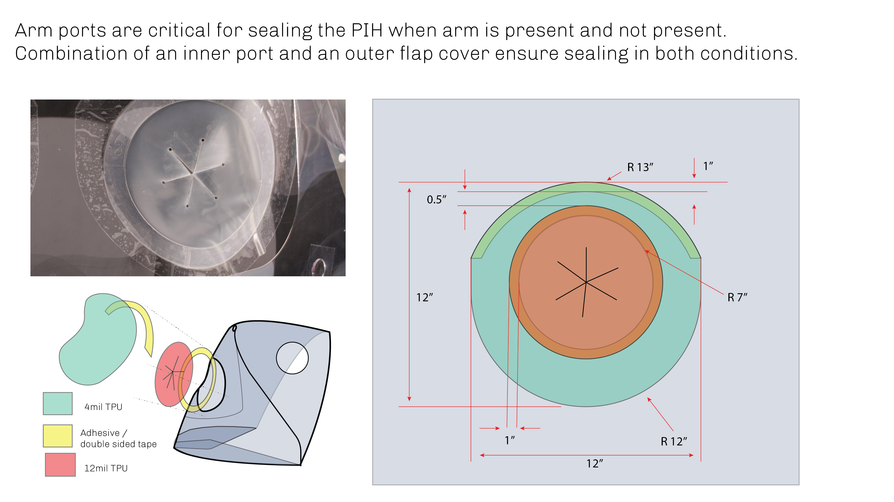
  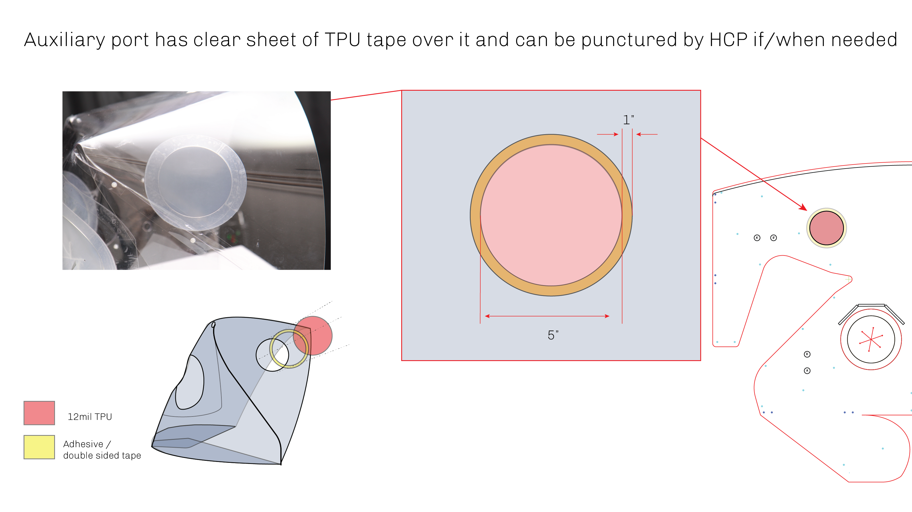
  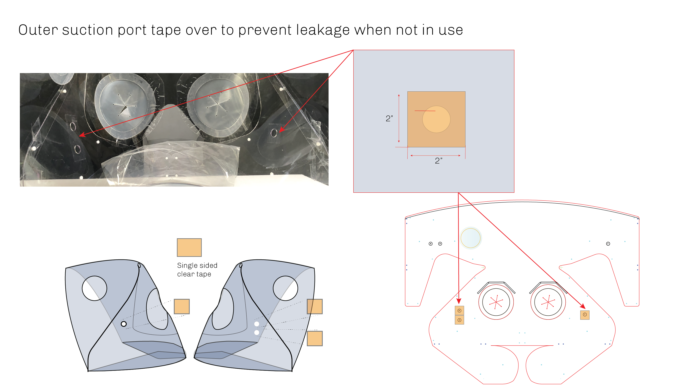

Each arm and auxiliary port on the Apollo PIH is composed of three primary components - a laser-cut 5 mil TPU portal, a clear, double-sided adhesive film, and a port cover.  

- TPU Portal: Laser cut from 5 mil TPU.  The portal is an inverted “mercedes” design, with circular relief holes at the tip of each cut to minimize the potential for tearing.  It can be CNC cut on a laser cutter or a knife cutting machine such as a ZUND.
- Adhesive Ring: The adhesive ring can be cut from a sheet of adhesive film.  
- The port cover/flap 

#### C) Bed attachment mechanism

  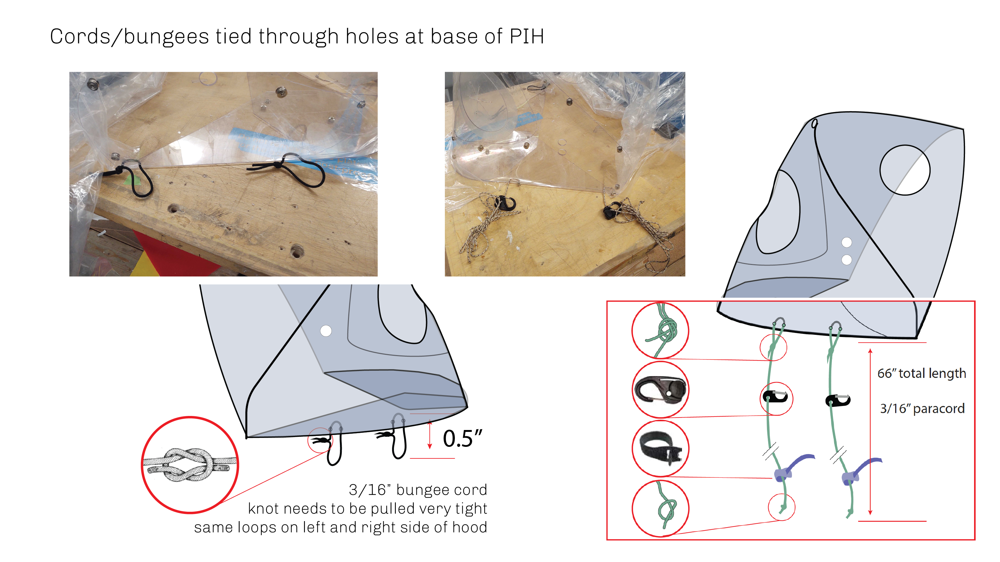

Perforations are located on the base perimeter (dark blue in _Reference drawing_) of the back plate to enable the use of cords/straps in order to attach the Apollo to different sized beds.

#### D) Drape

  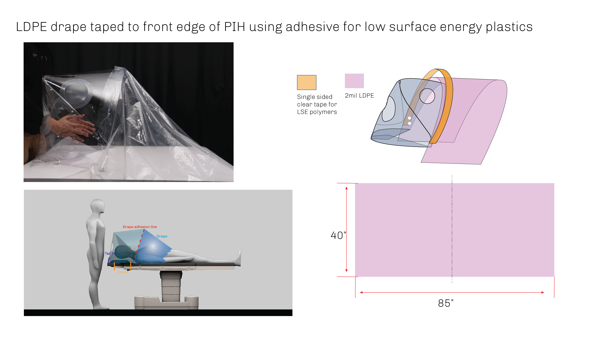

The drape is a rectangular piece of LDPE with dimensions 85” x 40” . Refer to the reference drawing and assembly instructions for details. A 12” offset has been left on both ends to facilitate tucking under the patient to get a good seal. 

#### E) Tail Piece

  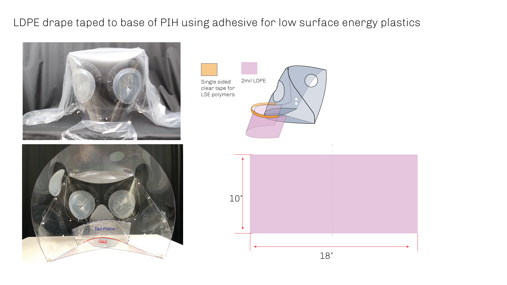

 
A small sheet of LDPE (Same as Drape) is stuck on the back plate and tucked under the baseplate to cover the gap between the baseplate and the back wall to maintain the seal.

### Assembly
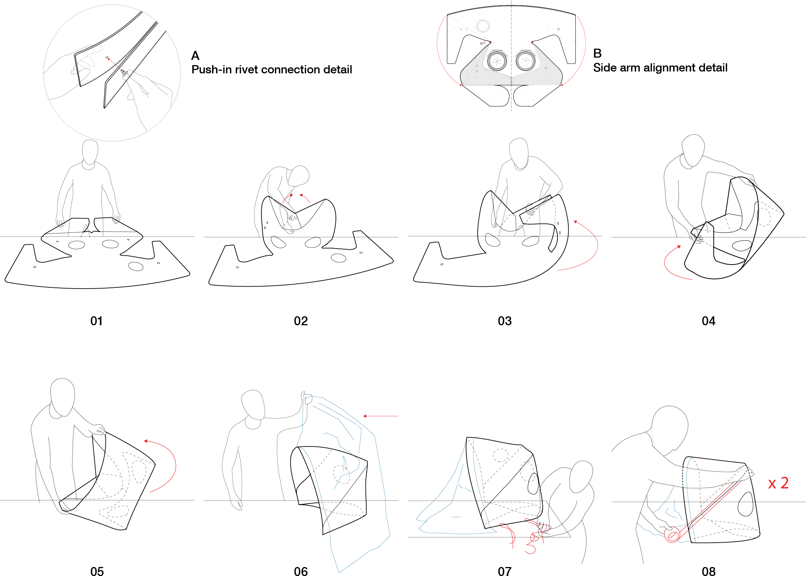
> 
- Step 01: Place Apollo PIH enclosure on a flat surface with the folded baseplate facing upwards.  
- Step 02: Fasten the opposing sides of the baseplate together using two push-in rivets located on the baseplate.  See detail A for connection detail.  
- Step 03: Fold one side arm toward the interior of the enclosure.  Fasten to the main portion of the enclosure using (8) push-in rivets. 
- Step 04: Repeat Step 03 for the opposite side arm.
- Step 05: Place the Apollo PIH upright so that the baseplate is resting on a horizontal surface. 
- Step 06: Attach the plastic drape to the front edge of the Apollo PIH using double-sided tape.
- Step 07: Fasten the provided straps to one side of the Apollo PIH.
- Step 08: Adhere clear tape over the external seams of the Apollo PIH (one per side), taking care to completely cover the seam. 

### Alternate Details
Below are some alternative details we have experimented with towards the end goal as design variants but these are yet to be tested clinically.

- **Material**

    While the Apollo PIH is designed to be fabricated from PET-G measuring 60mil (~1/16”) in thickness, though early prototypes fabricated from thinner, 30mil (~1/32”) were also sufficiently rigid. 

- **Form**

    Following alternatives have not been checked thoroughly in a clinical setting  and have only been provided as suggestions.

  - Apollo 1 Main Feature:
    - Use of Tabs and Slots instead of hardware
    

  - Apollo 1.5_Minimal Main Feature:
    - Reduction of overlap and material.
    

- **Arm Ports**
 
    

    
    

Multiple iterations of the armport design were undertaken with various materials and can be found in the diagram above. 
- Versions a and f Require a thinner gauge or extensible material as they can otherwise restrict arm movements while in use. Version f also requires a secondary drape taped over the opening to maintain a seal
- Versions b, c, and e work well with the specified 5+mil TPU and 1/16” silicone sheets (available on McMaster Carr). They feature a self-closing design and when used with the silicone sheets may not require a covering drape. Version c is best for thinner materials that lack the stiffness to hold their shape overwise
- Version d makes use of disposable PPE sleeves widely available in many material types. The sleeve is stretched around a rubber porthole seal (such as [this product).
- Version g simply uses two pieces of the drape material with an overlap to help limit air escape when in use.
- Clear PVC sheets were experimented with in both 0.08” and 0.04” thicknesses but were found to be too stiff to work properly and often grabbed at the sleeves and gloves when in use. 

## Documentation
>Evolution

    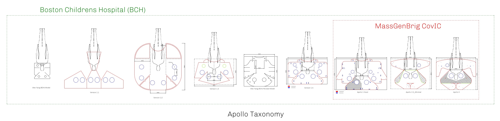
    

    
>Apollo3

    
    

>Apollo3 Clinical Testing

    
    

## Update - 2021_08_31 - Apollo 4 - Production Model (Nathan Phipps)
- Description
Apollo 4 includes several modifications for manufacturing efficiencies as well as continued requests from clinicians. Clinical updates include an extra set of hand ports for accessing patients, removal of the TPU auxiliary port located on the upper right (clinicians view) of the unit, and addition of elliptical suction ports to allow for cylindrical suction tubes entering at a steep angle into the hood. The main alteration for manufacturability was modified PETG body shape which could allow for two units to be cut out of a single 4'x8' sheet, thus increasing yield in production. This new shape was created by removing the "wings", which offered increased stability and stiffness and instead broadening the base of the unit to increase stability. Apollo Medical Solutions, a company started by Nate Phipps and Chris Tolles was formed to facilitate production and distribution of the Apollo 4; the device was produced by H. Loeb Corporation of New Bedford, MA and purchased for testing by Massachusetts General Hospital. 

- Apollo4  Assembly Instructions [**Print Ready**](apollo3_productionModel_instructionsForAssembly.pdf)
- Apollo4 Vector Cut File (.dxf) - [**Download HERE**](apollo3_productionModel_mainBody_twoPer4x8Sheet.dxf)
- Apollo4 BOQ (.xlsx) - [**Download HERE**](apollo3_productionModel_BOM.xlsx)

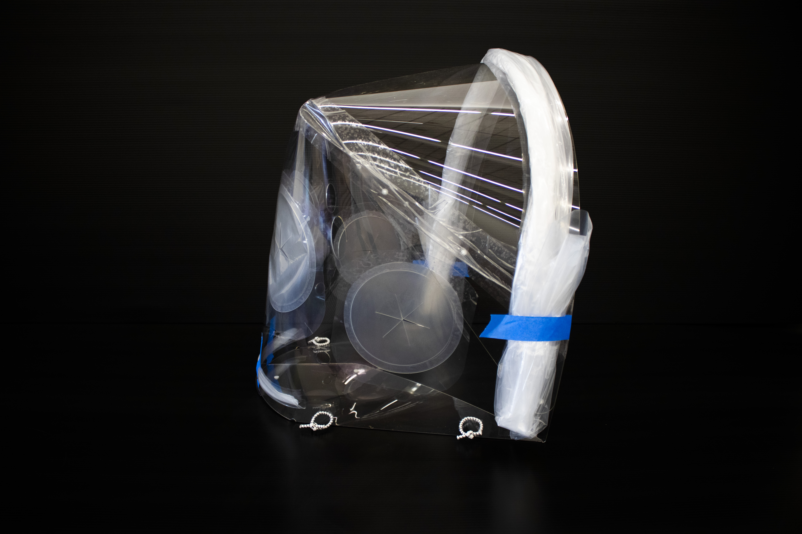

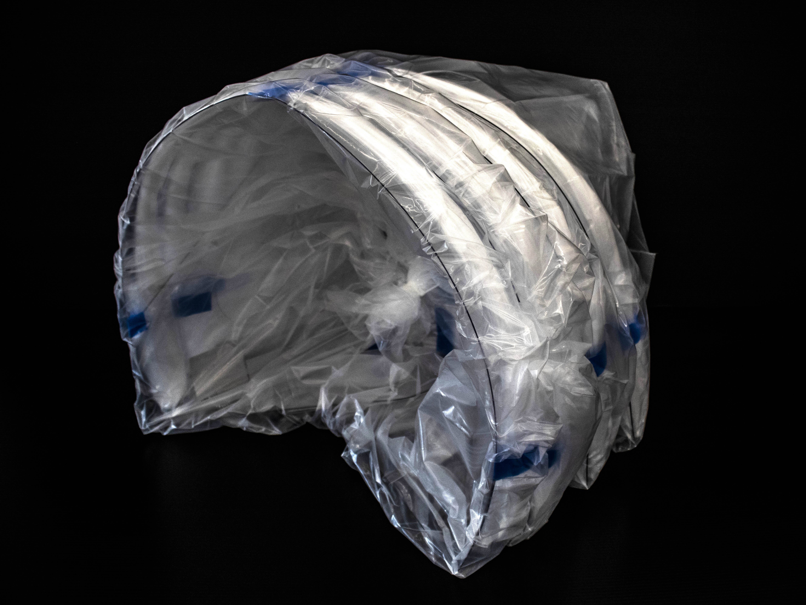

## Attribution 

Attribution Report 
- **PIH Dimensions:** 
MGB Group + Boston Children’s Hospital
- **Form/Concept:**
Saurabh Mhatre, Christopher Hansen, Nathan Phipps, Eric Howeler, Samuel Smith, MD, 
- **Arm Ports
Design:** Daniel Tish, Daniel Castello, Christopher Hansen, Jonathan Grinham, 
- **Clinical Input:** Samuel Smith, MD; 
- **Base Structure/Attachment Mechanism:**
Nathan Phipps, 
- **Drape:**
Nathan Phipps, Chris Hansen, 

## Acknowledgements
- Several clinicians provided key clinical feedback that drove design decisions, from MGH Anesthesia: Samuel Smith, MD, MPH; JP Wang, MD, PhD; Michelle Szabo, MD; Scott Streckenbach, MD; Alex Kuo, MD; Kendrick Shaw, MD, PhD; Angela Dai; Matt Vanneman, MD; Celeste Day.  From MGH Pediatrics, Kris Olson.  From the MGB Center for COVID Innovation; Li Li, PhD; Aditya Kumar; and Gary Tearney, MD, PHD.  
- Chris Hansen, Digital Fabrication Technical Specialist at the Harvard GSD;  Eric Howeler, Associate Professor of Architecture at the GSD; Saurabh Mhatre, Research Associate at the Harvard GSD & Harvard CGBC; and Nathan Phipps, played key roles in refining, prototyping, and coordinating fabrication of the Apollo 3 design. Zach Seibold, Jonathan Grinham, Daniel Tish, Daniel Castello and Ryan Pierce participated in design iteration and early prototyping.  
- James Weaver, Senior Research Scientist at the Wyss, facilitated the initial collaboration and has been instrumental in sourcing materials. 
- The Boston Children’s Hospital Surgical Innovation Fellowship team, including Heung Bae Kim, MD; Farokh Demehri, MD; Robert Crum, MD; Kyle Wu, MD; Brianna Slatnick, MD; and Alex Yang, BS, helped to develop the first versions of the Apollo design and provided clinical input throughout the design process.
- Initial design prototypes were produced with the help of PolyFab, and Roger Diebold (CEO, Solchroma Technologies) along with H. Loeb Corporation.

A full attribution list is as follows
Aaron Ross,
Adam Smith,
Aditya Kumar,
Alex Kobald,
Alex Yang,
Alexander Kuo,
Angela Dai,
Brianna Slatnick,
Celeste Day,
Chris Hansen,
Chris White,
Daniel Castelo,
Daniel Tish,
David Concha,
David Hamm,
David Wallace,
Eric Howeler,
Euan Mowat,
Farokh Demehri,
Fernanda Sakamoto,
Heung Bae Kim,
James Weaver,
Jonathan Grinham,
Jonathan Langer,
Koushik Garapti,
Kristian Olson,
Kyle Wu,
Lara Tomholt,
Martin Bechthold,
Mehra Golshan,
Michael Sherman,
Michele Szabo,
Norman Wen,
Robert Crum,
Ryan Pierce,
Sam Smith,
Saurabh Mhatre,
Ted Ngai,
Ted Sirota,
Zach Seibold.

## References

### Press
- Harvard GSD Press Release [Link](https://www.gsd.harvard.edu/2020/05/gsd-participates-in-global-open-source-effort-to-develop-patient-isolation-hoods-for-boston-hospitals/)
- Selected Articles
    - https://news.harvard.edu/gazette/story/2020/04/graduate-school-of-design-begins-ppe-production-for-area-hospitals/                                                 
    - https://www.architecturalrecord.com/articles/14570-architects-and-engineers-help-develop-isolation-hood-for-covid-19-patients     
    - https://archinect.com/news/article/150193745/harvard-ppe-team-uses-slack-to-design-patient-isolation-hood-for-hospital-use
    - https://www.dezeen.com/2020/04/20/patient-isolation-hood-coronavirus-personal-protective-equipment/            
    - https://www.dezeen.com/2020/04/21/design-input-healthcare-risk/                        
    - https://archpaper.com/2020/04/harvard-gsd-local-hospitals-coronavirus-personal-protective-equipment/  

### Similar Efforts
- [MIT Center for Bits and Atoms](https://gitlab.cba.mit.edu/pub/coronavirus/tracking)
- [Toledo plastic companies](https://www.wtol.com/article/news/health/coronavirus/local-plastic-companies-create-device-for-protecting-healthcare-workers/512-0068d863-82f7-436e-97ea-66212c4a67f8)
- [Care Shield](https://www.wcpo.com/news/coronavirus/cincinnati-doctors-invention-helps-protect-nycs-frontline-health-care-workers-from-covid-19)  
- [Stuck Design](https://www.youtube.com/watch?v=cFtV-cP0PMo)